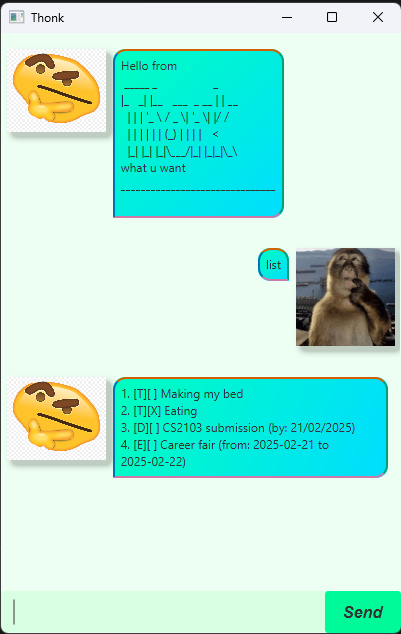

Thonk is a desktop app for managing contacts,
* Table of Contents
{:toc}

--------------------------------------------------------------------------------------------------------------------

## Quick start

1. Ensure you have Java `17` or above installed in your Computer. 
   **Mac users:** Ensure you have the precise JDK version prescribed [here](https://se-education.org/guides/tutorials/javaInstallationMac.html).

1. Download the latest `.jar` file from [here](https://github.com/momentumnn/ip/releases/tag/A-Release).

1. Copy the file to the folder you want to use as the _home folder_ for your Thonk.

1. Open a command terminal, `cd` into the folder you put the jar file in, and use the `java -jar thonk.jar` command to run the application. 
   A GUI similar to the below should appear in a few seconds. Note how the app contains some sample data. 
   

1. Type the command in the command box and press Enter to execute it. e.g. typing "todo new task" and pressing Enter will create a todo task called new task. 
   Some example commands you can try:

   * `list` : Lists all tasks.

   * `deadline submission /by 2025-01-12` : Creates a deadline task called submission with a deadline of 2025-01-12.

   * `delete 3` : Deletes the 3rd task shown in the current list.

   * `find submission` : Finds all tasks containing the word "submission".

   * `bye` : Exits the app.

1. Refer to the [Features](#features) below for details of each command.

---

## Features

### Adding a todo task: `todo`

Adds a todo task.

Format: `todo [taskname]`

Examples:
* `todo Wash clothes`
* `todo CS2103T tutorial work`

### Adding a deadline task: `deadline`

Adds a deadline task.

Format: `deadline [taskname] /by [date]`

Examples:
* `deadline Assignment 1 /by 2025-01-23`
* `deadline CS2103T submission /by 2025-01-12`

### Adding an event: `event`

Adds a event task.

Format: `event [taskname] /from [date] /to [date]`

Examples:
* `event Chinese New Year /from 2025-01-01 /to 2025-01-02`
* `event CS2103T project meeting /from 2025-01-10 /to 2025-01-11`
### Marking a task: `mark`

Marks a task as done.

Format: `mark INDEX`

Examples:
* `mark 1`
### Unmarking a task: `unmark`

Marks a task as not done.

Format: `unmark INDEX`

Examples:
* `unmark 1`

### Listing tasks : `list`

Shows a list of all tasks.

Format: `list`

### Locating task by name: `find`

Finds tasks whose names contain any of the given keywords.

Format: `find KEYWORD [MORE_KEYWORDS]`

* The search is case-insensitive. e.g `hans` will match `Hans`

Examples:
* `find career fair` returns `Career fair`  
  

### Deleting a task : `delete`

Deletes the specified task from the task list.

Format: `delete INDEX`

* Deletes the task at the specified `INDEX`.
* The index refers to the index number shown in the displayed person list.
* The index **must be a positive integer** 1, 2, 3, …​

Examples:
* `list` followed by `delete 2` deletes the 2nd person in the task list.

### Exiting the program : `bye`

Exits the program.

Format: `bye`

### Saving the data

Thonk data are saved in the hard disk automatically after any command that changes the data. There is no need to save manually.

### Editing the data file

Thonk data are saved automatically as a text file `[JAR file location]/data/Thonk.json`. Advanced users are welcome to update data directly by editing that data file.

:exclamation: **Caution:**
If your changes to the data file makes its format invalid, Thonk will disregard the invalid row. Hence, it is recommended to take a backup of the file before editing it. 
Furthermore, certain edits can cause the Thonk to behave in unexpected ways (e.g., if a value entered is outside of the acceptable range). Therefore, edit the data file only if you are confident that you can update it correctly.

--------------------------------------------------------------------------------------------------------------------

## FAQ

**Q**: How do I transfer my data to another Computer? 
**A**: Install the app in the other computer and overwrite the empty data file it creates with the file that contains the data of your previous Thonk home folder.

--------------------------------------------------------------------------------------------------------------------

## Command summary

Action | Format, Examples
--------|------------------
**Todo** | `todo [taskname]`  e.g., `todo Wash clothes`
**Deadline** | `deadline [taskname] /by [date]`  e.g., `deadline Assignment 1 /by 2025-01-23`
**Event** | `event [taskname] /from [date] /to [date]`  e.g., `event Chinese New Year /from 2025-01-01 /to 2025-01-02`
**Delete** | `delete INDEX`  e.g., `delete 3`
**Find** | `find KEYWORD [MORE_KEYWORDS]`  e.g., `find Career Fair`
**Mark** | `mark INDEX`  e.g., `mark 3`
**Unmark** | `unmark INDEX`  e.g., `unmark 3`
**List** | `list`
**Exit** | `bye`
